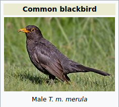

Papageno data
=============

This directory contains Python scripts to fetch and process input data. Its
output is a SQLite3 database called `master.db`.

I'm a software developer, not an ornithologist, and I don't know much about
birds at all. That means I'm not able to make any informed choices about which
species to include, which recordings are representative, and so on; I have to
rely on external data sources and semi-clever algorithms to make these
decisions for me.

Data sources
------------

The following sources of data are used.

- [xeno-canto](https://www.xeno-canto.org/), a website with over half a million
  bird sound recordings recorded and uploaded by volunteers, and made available
  under Creative Commons licenses.

- [Wikipedia](https://en.wikipedia.org/) and
  [WikiMedia Commons](https://commons.wikimedia.org/) are used as a source for
  photos of birds, often licensed under Creative Commons or public domain.

- [IOC World Bird List](https://www.worldbirdnames.org/) is used as the
  canonical taxonomy of bird species, and also for translations of species
  names into various languages, licensed under Creative Commons.

- [eBird](https://ebird.org/) is a crowd-sourced bird observation platform,
  whose data is published by [GBIF](https://www.gbif.org/) under a Creative
  Commons license. This data is used to determine which species occur where in
  the world.

Pipeline structure
------------------

The data included in the app is produced in about a dozen consecutive stages.
Each stage is described in detail below.

### `load_species`

The inputs consist of the following Excel spreadsheets (XLSX files) from
[IOC](https://www.worldbirdnames.org/ioc-lists/master-list-2/):

- Multilingual Version (v9.1, Excel file XLSX, 6.5Mb)

  

- Comparison of IOC 9.1 with other world lists (XLSX, 6.0Mb)

  

Both files are also checked into the [`sources/`](sources/) directory for
convenience.

We use the 9.1 version, even though 10.1 is already available, because at the
time of writing
[xeno-canto is based on the 9.1 version](https://www.xeno-canto.org/article/234).

One might think that there is a single "list of all bird species in the world"
somewhere, and that each species has a unique, distinct scientific ("Latin")
name, but nothing could be farther from the truth! The problem is that science
keeps advancing, and that people sometimes disagree. So apart from the IOC list
that I'm using because xeno-canto uses it too, another notable list is due to
J.F. Clements et al, and that is the list used by eBird. Fortunately, IOC also
publishes a spreadsheet that maps Clements' (and other) names to the names used
by IOC. Not every species recognized by IOC is also a species according to
Clements, and vice versa. Life is messy.

The `load_species` stage simply takes these two spreadsheets and puts them into
the `master.db` database, assigning each species (as recognized by IOC) a
unique numeric identifier. For each of the 10896 species on the IOC list, it
stores:

- species identifier
- scientific name according to IOC
- scientific name according to Clements (if any)
- common name of the species in 30 different languages

### `eod_aggregator`

The input consists of the massive eBird Observational Dataset (EOD) from
[eBird](https://ebird.org/), downloadable from
[GBIF](https://www.gbif.org/occurrence/download?dataset_key=4fa7b334-ce0d-4e88-aaae-2e0c138d049e).
It is a list of over 500 million bird observations, annotated with, among others:

- date/time of observation
- latitude/longitude
- scientific name of observed species
- number of individual specimens observed


We use this data in the app to figure out, based on your location, which
species should be taught and in which order.

The EOD dataset is a ZIP file of 68 GB, which contains a TSV (tab-separated
values) file of 253 GB. For size reasons, it is not checked into this
repository; it can be downloaded from GBIF after creating a free account.

Processing this much data would take a long time in Python, so this stage is
implemented as a standalone Rust program, which runs in about 35 minutes. It
cannot be invoked from the `master.py` script.

The `eod_aggregator` aggregates all observations from the dataset into regions
regions of 1 degree latitude by 1 degree longitude. For each region, it counts
the number of observations for each species.

At the equator, such a region is almost square and measures about 111 km by 111
km; as you move away from the equator, the regions get narrower because the
lines of equal longitude converge towards the poles. This is not really an
issue for our application; it just means that the resolution is higher there.

Some filtering is applied: for a species to be present in the output, it must
be observed at least 10 times in at least 3 different years. This is an attempt
to weed out any anomalies in the data.

Note that eBird published a
[best practices](https://cornelllabofornithology.github.io/ebird-best-practices/)
guide based on the case study
["Best practices for making reliable inferences from citizen science data: case study using eBird to estimate species distributions", A. Johnston et al, 2019](https://www.biorxiv.org/content/10.1101/574392v2).
The most important thing to do, according to the paper, is to use _complete_
checklists only. To understand what that means, you need to know how volunteers
enter data into eBird. They go out to some location with a checklist of birds
that they might encounter, and they mark species that they see on their
checklist. However, some birders might only be interested in particular
species, and not mark _every_ species that they observe; for example, they
might not care about very common species like mallards. Such checklists are
considered _incomplete_. They result in a bias in the data, where less common
species have a higher chance of being recorded.

However, the data set that I downloaded (the "simple" one rather than the
"Darwin Core archive") does not contain information about whether a given
observation came from a complete or incomplete checklist. Rather than
downloading the even bigger Darwin Core to see if it does have this data, I
chose to disregard the problem. After all, we only use this data to create
_relative_ rankings of species in a particular location, so as long as a
rare species isn't recorded more often (in absolute terms) than a more common
species, it should not make a difference.

The program writes its output to `sources/eod_regions.csv` which _is_ included
in this repository, so if you want to work on the data processing, you don't
need either Rust or the eBird dataset.

### `load_regions`

This simply takes `sources/eod_regions.csv` produced by the `eod_aggregator`
program and ingests it into the `master.db` database. In hindsight, maybe I
could have Rust write to the database directly, but then `master.db` (556 MB)
would need to be checked into this repository too.

### `load_recordings`

This stage uses the [xeno-canto API](https://www.xeno-canto.org/explore/api) to
fetch metadata about _all_ recordings hosted on xeno-canto. Because an empty
query is not allowed by the API, the script simply queries for a very large
range of catalogue numbers (1-999999999). The API then returns about 1000 pages
of data, each of which takes at least a few seconds, so it takes a while to
run. The total number of recordings at the time of writing was 526602.

An abridged example of the JSON we get back from the API:

```json
{
  "numRecordings": "534648",
  "numSpecies": "10191",
  "page": 11,
  "numPages": 1070,
  "recordings": [
    {
      "id": "270409",
      "gen": "Cygnus", "sp": "atratus", "ssp": "", "en": "Black Swan",
      "rec": "Krzysztof Deoniziak",
      "cnt": "Australia", "loc": "Mareeba Tropical Savanna and Wetland Reserve, Queensland",
      "lat": "-16.934", "lng": "145.3495", "alt": "420",
      "type": "call",
      "url": "//www.xeno-canto.org/270409",
      "file": "//www.xeno-canto.org/270409/download",
      "file-name": "XC270409-cygnus_atratus_mareeba_wetlands_queensland_18.08.2015_1510.mp3",
      "sono": {
        "small": "//www.xeno-canto.org/sounds/uploaded/VCROLXMVLX/ffts/XC270409-small.png",
        "med": "//www.xeno-canto.org/sounds/uploaded/VCROLXMVLX/ffts/XC270409-med.png",
        "large": "//www.xeno-canto.org/sounds/uploaded/VCROLXMVLX/ffts/XC270409-large.png",
        "full": "//www.xeno-canto.org/sounds/uploaded/VCROLXMVLX/ffts/XC270409-full.png"
      },
      "lic": "//creativecommons.org/licenses/by-nc-nd/4.0/",
      "q": "B",
      "length": "0:12",
      "time": "15:00", "date": "2015-08-18",
      "uploaded": "2015-08-25",
      "also": [""],
      "rmk": "Birds swimming in a lake.",
      "bird-seen": "yes",
      "playback-used": "no"
    },
    ...
  ]
}
```

The script stores all fields into `master.db`, but here are the ones we mostly
care about:

- genus and species, which together form the scientific name (following IOC
  taxonomy); subspecies are ignored
- list of any species audible in the background
- type(s), for example "call", "song" or
  ["aggression displayed towards reflection in mirror"](https://www.xeno-canto.org/439354)
- URL for downloading the actual recording file
- URLs for downloading sonograms (spectrograms)
- recording quality (A is best, E is worst) as voted by xeno-canto users
- recording duration
- license and attribution details

### `load_images`

This stage uses the
[Wikipedia API](https://www.mediawiki.org/wiki/API:Main_page), offered by both
Wikipedia and WikiMedia Commons, to find a suitable photo of each species.
Because both these wikis contain very free-form data, this script is easily the
most hacky part of the pipeline. For each species (according to our IOC list)
it does the following:

1. Fetch the Wikipedia page with the species's scientific name. This normally
   redirects to a page with the species's common name; for example,
   [/wiki/Turdus_merula](https://en.wikipedia.org/wiki/Turdus_merula) redirects
   to [/wiki/Common_blackbird](https://en.wikipedia.org/wiki/Common_blackbird).

   

2. In the page source, look for a `speciesbox` template and extract the genus
   and species. Log a warning if they don't match what we expected. This
   happens quite a lot, because not everyone agrees on taxonomy. But in the
   cases I checked, we always ended up on the right page.

   
   &nbsp;&nbsp;&nbsp;
   

3. In the same `speciesbox`, find the image. This is the name of a page on
   WikiMedia Commons (except
   [when it's not](https://en.wikipedia.org/wiki/File:Solitarysandpiper.jpg)).

   

4. Fetch that page from WikiMedia Commons using the
   [imageinfo API](https://www.mediawiki.org/wiki/API:Imageinfo). Every such
   page is just a regular wiki page, containing arbitrary, machine-unreadable
   content including license details. Fortunately, with `iiprop=extmetadata`,
   the API will in many cases kindly return licensing information that has
   already been parsed by MediaWiki.

   [https://commons.wikimedia.org/w/api.php?action=query&prop=imageinfo&titles=File%3ACommon_Blackbird.jpg&iiprop=extmetadata&formatversion=2&format=json](https://commons.wikimedia.org/w/api.php?action=query&prop=imageinfo&titles=File%3ACommon_Blackbird.jpg&iiprop=extmetadata&formatversion=2&format=json)

   ```json
   {
     "batchcomplete": true,
     "query": {
       ...
       "pages": [
         {
           "pageid": 16110223,
           "ns": 6,
           "title": "File:Common Blackbird.jpg",
           "imagerepository": "local",
           "imageinfo": [
             {
               "extmetadata": {
                 ...,
                 "Credit": {
                   "value": "<span class=\"int-own-work\" lang=\"en\">Own work</span>",
                   "source": "commons-desc-page",
                   "hidden": ""
                 },
                 "Artist": {
                   "value": "<a rel=\"nofollow\" class=\"external text\" href=\"http://photo-natur.de\">Andreas Trepte</a>",
                   "source": "commons-desc-page"
                 },
                 "Permission": {
                   "source": "commons-desc-page",
                   "hidden": ""
                 },
                 "LicenseShortName": {
                   "value": "CC BY-SA 2.5",
                   "source": "commons-desc-page",
                   "hidden": ""
                 },
                 ...
               }
             }
           ]
         }
       ]
     }
   }
   ```

5. Store the resulting image URL, dimensions and license information into
   `master.db`.

Of 10896 species, this algorithm identified 9578 images, so the vast majority
of species are covered.

### `regions_to_gpkg`

This is a debug helper that stores the regions into a GeoPackage file. Such a
file can be opened in the QGIS application to get a quick visual overview of
species coverage. A suitable QGIS project is included in the [`qgis/`](qgis/)
subdirectory.


It's sad that such large parts of Asia and Africa are barely covered by this
data set. Deserts explain some of the missing territory, but there is also a
bias because there are few eBird observers in those regions. All I can do is
hope that there will be few Papageno users in those parts of the world as well.

### `select_species`

This stage of the pipeline select which species will be included in the app. We
can't include all species because the app would be several gigabytes, so we
have to be a bit selective. Somewhat arbitrarily, I decided to include 1200
species.

To be included, a species must meet the following criteria:

- There must be at least 50 recordings on xeno-canto for this species. This
  ensures that we have enough recordings to pick from.
- The species must not be
  [restricted](https://www.xeno-canto.org/help/FAQ#restricted). Some endangered
  species on xeno-canto are marked "restricted" to protect them from trapping
  or harassment, and their recordings cannot be downloaded freely. Apart from
  that, arguably such species should also be omitted from the app to further
  protect them.
- There must be an image available.
- The image must be under a known and suitable license.
- The image must be at least 512 by 512 pixels in size.

This leaves us with about 2400 suitable species, which is still too much to
include. To filter them further, the script sorts the species based on the
number of regions (1×1 degree grid cells) in which it occurs, then takes the
top 1200 of that list. This makes sure that we pick species that will be
relevant to people in most locations, at the expense of species that may be
very common in a small area but never seen outside it.

### `analyze_recordings`

This script runs an analysis on the sonograms of each recording to produce an
estimate of the quality of that recording, to use as a basis for deciding which
recordings to include in the app. It is needed because the quality (A-E)
indicated by xeno-canto is often not representative; probably people just don't
vote enough.

For all recordings of selected species, it first downloads the sonogram. A
sonogram (or spectrogram) is a representation of the sound in the form of an
image: the horizontal axis represents time, the vertical axis represents
frequency. The more prevalent (loud) a frequency is at a given time, the darker
the pixel will be. Sonograms on xeno-canto (at least the small ones we use)
only show the first 10 seconds of the recording.

This gives a lot of information about the sound. Here's a nice and clean
recording of _Turdus merula_, the common blackbird, catalogue number
[XC410428](https://www.xeno-canto.org/410428):


For comparison, here's one with a lot of background noise,
[XC420503](https://www.xeno-canto.org/420503):


The aim of this script is to determine from the sonogram which recordings are
cleanest, and assign those a higher quality score so they will be included in
the app. After some experimentation, I came up with this algorithm:

1. Invert the image so that higher numbers (closer to 255) mean louder, not
   quieter. This is not necessary; it just makes things easier to reason about.
2. Find the 30th percentile level for each individual row. We assume that the
   bird doesn't sing for more than 70% of the clip, so this gives an indication
   of the background noise for each frequency band.
3. Take the maximum of this across all rows to get an indication of the overall
   noise. Subtract it from 255 (so that higher is better), square it
   (empirically proven to be better) and call this `noise_score`.

This works pretty well for finding recordings free of noise, but it has a
problem; it thinks recordings like
[XC484007](https://www.xeno-canto.org/484007) are fantastic:


Clearly, absence of noise is not sufficient; we also want presence of bird! So:

4. Find the maximum for each individual column.
5. Take the standard deviation across these maxima. This gives a measure of
   variety in loudness. If we just took the maximum across all columns, we'd
   often get 255 and miss out on those recordings that contain interesting
   sounds but are just a bit quieter. Call this standard deviation
   `signal_score`.
6. The final quality score is `signal_score * noise_score`. This way, a
   recording has to score highly on _both_ scales in order to be considered.

It's a CPU-intensive process, so the results are stored in `master.db` and not
recomputed unless requested.

### `select_recordings`

For the most common species, xeno-canto has more than a thousand recordings per
species available. That's obviously more than we can include in the app, so we
must be selective.

The first question is: how many recordings do we include for each species? For
the most common species, the ones that people are most likely to encounter, it
makes sense to include a bit more variety. In the end, I settled on the
following equation:

    num_recordings = max(8 * ranking^0.997, 3)

Here, `ranking` is the ranking from `select_species`, which is based on the
number of regions in which the species occurs. This gives 8 recordings for the
most common species, 7.976 (rounded again to 8) for the next, and so on, down
to a minimum of 3 recordings for less common species.

Now, for each species, we have to select which recordings to include. To be
considered, a recording has to meet these criteria:

- Must have a download URL. This is for the case of individually restricted
  recordings of an otherwise not restricted species; I'm not sure these exist
  at all.
- Must have a sonogram analysis present in the database. This is to handle
  cases of broken sonogram URLs.
- Must not be blacklisted. There's a manually maintained
  [`recordings_blacklist.txt`](recordings_blacklist.txt) used for various
  corner cases, like broken files.

Recordings meeting these criteria are sorted based on (from high to low
priority):

1. Quality rating as indicated by xeno-canto.
2. Number of type tags that are not included in some small, fixed list; fewer
   is better. This helps to weed out recordings annotated with "chainsaw" or
   "rare pee-pee-pee call", and most notably, "juvenile". (Young birds don't
   usually make very distinctive sounds.)
3. Number of species audible in the background, as annotated by the recordist.
   Fewer is better.
4. The sonogram quality score.
5. The length; must be at least 2 seconds, but longer than that is not better.
6. The hash of the recording ID, as a tie breaker.

Now we just take the top recordings and we're done, right? Maybe; but I chose
to make one further step. Ornithologists distinguish two types of
[vocalizations](https://en.wikipedia.org/wiki/Bird_vocalization): "songs" are
longer and relatively complex whereas "calls" are shorter and relatively
simple.

Some birds are very recognizable by their song (common blackbird), some by
their call (crow). If we assume that their most noteworthy sound is also the
most recorded, then we can make sure we get a good sample of sounds by
balancing the type tags of selected recordings in the same way. For example, if
there are 1000 recordings tagged "song" and 500 tagged "call", we'd want to
include songs and calls in a 2:1 ratio. In reality, it's a bit more complex,
because we don't just have two types; we want to treat other common types like
"alarm call" in the same way.

The script applies a somewhat tricky algorithm that attempts to do this; see
the source code for details. The problem is similar in nature to [proportional
representation](https://en.wikipedia.org/wiki/Proportional_representation) in
elections, so there is no perfect solution, only different tradeoffs.

Finally, the IDs of selected recordings are stored in `master.db`. At the time
of writing, for the 1200 selected species, we have 4227 recordings in total.

### `store_audio_files`

This stage produces the final audio files in Ogg/Vorbis format for inclusion in
the app. It mostly consists of obvious steps like fetching MP3, downmixing
stereo to mono, adding fades and normalizing the volume.

The interesting part is the trimming. Some recordings on xeno-canto are minutes
or even hours long, and we obviously don't want to include those in full, so we
need to select which part to include.

It works by initially trimming down to the first 12 seconds. This may sound
short, but it's plenty of time to allow a bird to be identified. Then we
determine the 20th percentile volume level. Assuming the bird is silent for at
least 20% of the clip, this gives us a threshold to distinguish bird sound from
silence. We then find the longest stretch of bird sound, and cut the clip
shortly after that. This guarantees that we include a good portion of sound,
while also keeping recordings as short as possible.

The resulting file size of the 4227 selected recordings is what makes up the
bulk of the app: 239 MB.

### `store_images`

This stage downloads the images from WikiMedia Commons whose URLs we previously
determined, resizes them to a maximum resolution, and exports them as WebP to
the app's assets directory. WebP files are
[a quarter to a third smaller than JPEG](https://developers.google.com/speed/webp/docs/webp_study)
at a comparable quality level, but the 1200 resulting images together still
weigh 60 MB.

### `store_database`

This final stage takes the relevant portions of `master.db` (selected species,
selected recordings, regions), and writes them out to a new SQLite database
`app.db` which is included in the app's assets and bundled in the final app
distribution. The resulting database is about 13 MB, most of which is taken up
by the table of regions and associated species per region.

Running the pipeline
--------------------

Python 3.6 or higher is needed. Poetry is used to create and maintain a virtual
environment with all dependencies. This uses the supplied `pyproject.toml` file
to record dependencies and versions.

To create and enter such a virtual environment:

    poetry install
    poetry shell

You need to create a `cache` directory first, which is used to hold the results
of web fetches, so they don't need to be downloaded more than once:

    mkdir cache

The contents of the cache can get pretty big (over 30 GB), so if you want it to
be on a different partition or hard drive, use a symlink instead.

To get usage information, run:

    ./master.py --help

Each stage described above has a corresponding argument; to run stages
`store_images` and `store_database`, you'd run:

    ./master.py --store_images --store_database

Typically, none of the optional arguments are needed; the defaults are set to
the values used to produce the "official" `master.db`.

Exploring data with the web UI
------------------------------

Launch a Poetry shell, then run:

    ./web_ui.py

Navigate to <http://localhost:8080> for a graphical browser of data.


Developing
----------

Code is linted with `pylint`, which is configured through the supplied
`pylintrc`. Run like this to do the linting:

    pylint *.py
